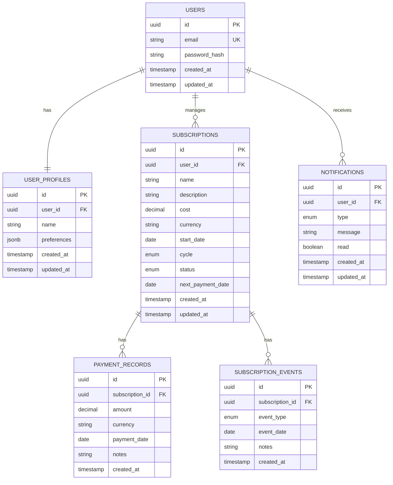

# Database Schema: Subscription Service Management Panel

## Overview
This document defines the database schema for the Subscription Service Management Panel application. The schema is designed for PostgreSQL and focuses on supporting the core features of user management, subscription tracking, and statistical analysis.

## Entity Relationship Diagram


## Tables

### users
Stores user authentication information.

| Column | Type | Constraints | Description |
|--------|------|-------------|-------------|
| id | UUID | PRIMARY KEY | Unique identifier |
| email | VARCHAR(255) | UNIQUE, NOT NULL | User's email address |
| password_hash | VARCHAR(255) | NOT NULL | Hashed password |
| created_at | TIMESTAMP | NOT NULL | Record creation time |
| updated_at | TIMESTAMP | NOT NULL | Record last update time |

### user_profiles
Stores additional user information and preferences.

| Column | Type | Constraints | Description |
|--------|------|-------------|-------------|
| id | UUID | PRIMARY KEY | Unique identifier |
| user_id | UUID | FOREIGN KEY, NOT NULL | Reference to users table |
| name | VARCHAR(255) | | User's display name |
| preferences | JSONB | | User preferences as JSON |
| created_at | TIMESTAMP | NOT NULL | Record creation time |
| updated_at | TIMESTAMP | NOT NULL | Record last update time |

### subscriptions
Stores subscription information.

| Column | Type | Constraints | Description |
|--------|------|-------------|-------------|
| id | UUID | PRIMARY KEY | Unique identifier |
| user_id | UUID | FOREIGN KEY, NOT NULL | Reference to users table |
| name | VARCHAR(255) | NOT NULL | Subscription name |
| description | TEXT | | Subscription description |
| cost | DECIMAL(10,2) | NOT NULL | Subscription cost |
| currency | VARCHAR(3) | NOT NULL | Currency code (e.g., USD) |
| start_date | DATE | NOT NULL | Subscription start date |
| cycle | VARCHAR(20) | NOT NULL | Payment cycle (Daily, Weekly, Monthly, Quarterly, Half Yearly, Yearly) |
| status | VARCHAR(20) | NOT NULL | Subscription status (Active, Paused, Cancelled) |
| next_payment_date | DATE | NOT NULL | Next payment due date |
| created_at | TIMESTAMP | NOT NULL | Record creation time |
| updated_at | TIMESTAMP | NOT NULL | Record last update time |

### payment_records
Stores historical payment information.

| Column | Type | Constraints | Description |
|--------|------|-------------|-------------|
| id | UUID | PRIMARY KEY | Unique identifier |
| subscription_id | UUID | FOREIGN KEY, NOT NULL | Reference to subscriptions table |
| amount | DECIMAL(10,2) | NOT NULL | Payment amount |
| currency | VARCHAR(3) | NOT NULL | Currency code (e.g., USD) |
| payment_date | DATE | NOT NULL | Date payment was made |
| notes | TEXT | | Additional payment notes |
| created_at | TIMESTAMP | NOT NULL | Record creation time |

### subscription_events
Stores significant subscription events (e.g., status changes).

| Column | Type | Constraints | Description |
|--------|------|-------------|-------------|
| id | UUID | PRIMARY KEY | Unique identifier |
| subscription_id | UUID | FOREIGN KEY, NOT NULL | Reference to subscriptions table |
| event_type | VARCHAR(50) | NOT NULL | Type of event (Created, Renewed, Paused, Resumed, Cancelled) |
| event_date | DATE | NOT NULL | Date event occurred |
| notes | TEXT | | Additional event notes |
| created_at | TIMESTAMP | NOT NULL | Record creation time |

### notifications
Stores user notifications.

| Column | Type | Constraints | Description |
|--------|------|-------------|-------------|
| id | UUID | PRIMARY KEY | Unique identifier |
| user_id | UUID | FOREIGN KEY, NOT NULL | Reference to users table |
| type | VARCHAR(50) | NOT NULL | Notification type (Renewal, Payment, Status) |
| message | TEXT | NOT NULL | Notification message |
| read | BOOLEAN | NOT NULL, DEFAULT FALSE | Whether notification has been read |
| created_at | TIMESTAMP | NOT NULL | Record creation time |
| updated_at | TIMESTAMP | NOT NULL | Record last update time |

## Indexes

### users
- PRIMARY KEY on `id`
- UNIQUE INDEX on `email`

### user_profiles
- PRIMARY KEY on `id`
- INDEX on `user_id`

### subscriptions
- PRIMARY KEY on `id`
- INDEX on `user_id`
- INDEX on `status`
- INDEX on `next_payment_date`

### payment_records
- PRIMARY KEY on `id`
- INDEX on `subscription_id`
- INDEX on `payment_date`

### subscription_events
- PRIMARY KEY on `id`
- INDEX on `subscription_id`
- INDEX on `event_date`

### notifications
- PRIMARY KEY on `id`
- INDEX on `user_id`
- INDEX on `read`
- INDEX on `created_at`

## Enumerations

### subscription_cycle
- Daily
- Weekly
- Monthly
- Quarterly
- Half Yearly
- Yearly

### subscription_status
- Active
- Paused
- Cancelled

### event_type
- Created
- Renewed
- Paused
- Resumed
- Cancelled

### notification_type
- Renewal
- Payment
- Status

## Relationships

- One user can have many subscriptions (one-to-many)
- One user has one user profile (one-to-one)
- One user can have many notifications (one-to-many)
- One subscription can have many payment records (one-to-many)
- One subscription can have many subscription events (one-to-many)

## Migration Strategy

1. Create base tables: users, user_profiles
2. Create subscription-related tables: subscriptions, payment_records, subscription_events
3. Create notification tables: notifications
4. Add indexes for performance optimization
5. Add foreign key constraints to ensure data integrity

## Sample Queries

### Get all active subscriptions for a user
```sql
SELECT * FROM subscriptions
WHERE user_id = $1 AND status = 'Active'
ORDER BY next_payment_date ASC;
```

### Calculate monthly spending for a user
```sql
SELECT SUM(cost) as total_monthly_cost
FROM subscriptions
WHERE user_id = $1 AND status = 'Active' AND cycle = 'Monthly';
```

### Get upcoming payments in the next 30 days
```sql
SELECT * FROM subscriptions
WHERE user_id = $1 AND status = 'Active' AND next_payment_date <= CURRENT_DATE + INTERVAL '30 days'
ORDER BY next_payment_date ASC;
```

### Get unread notifications for a user
```sql
SELECT * FROM notifications
WHERE user_id = $1 AND read = FALSE
ORDER BY created_at DESC;
``` 