# Frontend Component Architecture: Subscription Service Management Panel

## Overview
This document outlines the component architecture for the Subscription Service Management Panel frontend. The frontend is built using React with TypeScript, Tailwind CSS for styling, and Radix UI for accessible components.

## Component Hierarchy

```mermaid
graph TD
    App --> Layout
    Layout --> Header
    Layout --> Sidebar
    Layout --> MainContent
    Layout --> Footer
    
    MainContent --> AuthPages
    MainContent --> Dashboard
    MainContent --> SubscriptionPages
    MainContent --> StatisticsPages
    MainContent --> SettingsPages
    
    AuthPages --> LoginPage
    AuthPages --> RegisterPage
    AuthPages --> ForgotPasswordPage
    AuthPages --> ResetPasswordPage
    
    Dashboard --> DashboardHeader
    Dashboard --> UpcomingPayments
    Dashboard --> SubscriptionSummary
    Dashboard --> ExpenseTrends
    Dashboard --> RecentActivity
    
    SubscriptionPages --> SubscriptionList
    SubscriptionPages --> SubscriptionDetail
    SubscriptionPages --> SubscriptionForm
    SubscriptionPages --> PaymentHistory
    
    StatisticsPages --> MonthlyExpenses
    StatisticsPages --> YearlyExpenses
    StatisticsPages --> SubscriptionBreakdown
    StatisticsPages --> ExportOptions
    
    SettingsPages --> ProfileSettings
    SettingsPages --> NotificationSettings
    SettingsPages --> SecuritySettings
    
    Header --> Logo
    Header --> MainNav
    Header --> UserMenu
    Header --> NotificationBell
    
    Sidebar --> SidebarNav
    Sidebar --> SidebarFooter
```


## Core Components

### Layout Components

#### `App`
- Root component that handles routing and global state
- Responsibilities:
  - Authentication state management
  - Route configuration
  - Global error handling
  - Theme management

#### `Layout`
- Main layout wrapper for the application
- Responsibilities:
  - Consistent layout structure
  - Responsive layout management
  - Contains Header, Sidebar, MainContent, and Footer

#### `Header`
- Top navigation bar
- Responsibilities:
  - Brand identity (logo)
  - Main navigation
  - User menu
  - Notification access

#### `Sidebar`
- Side navigation panel
- Responsibilities:
  - Section navigation
  - Collapsible on mobile
  - Quick access to key features

#### `MainContent`
- Content container for page components
- Responsibilities:
  - Page transitions
  - Content padding and layout
  - Scroll management

### Authentication Components

#### `LoginPage`
- User login interface
- Responsibilities:
  - Email/password form
  - Form validation
  - Error handling
  - "Remember me" functionality
  - Password reset link

#### `RegisterPage`
- New user registration
- Responsibilities:
  - Registration form
  - Validation
  - Terms acceptance
  - Success confirmation

#### `ForgotPasswordPage`
- Password recovery request
- Responsibilities:
  - Email input
  - Request submission
  - Confirmation display

#### `ResetPasswordPage`
- Password reset form
- Responsibilities:
  - New password input
  - Password confirmation
  - Token validation
  - Success confirmation

### Dashboard Components

#### `Dashboard`
- Main dashboard container
- Responsibilities:
  - Layout of dashboard widgets
  - Data fetching coordination

#### `UpcomingPayments`
- Displays upcoming subscription renewals
- Responsibilities:
  - List of upcoming payments
  - Date and amount information
  - Quick actions (pay, remind)

#### `SubscriptionSummary`
- Summary of active subscriptions
- Responsibilities:
  - Count of active/paused subscriptions
  - Total monthly/yearly cost
  - Quick filters

#### `ExpenseTrends`
- Visualization of spending trends
- Responsibilities:
  - Line/bar chart of expenses over time
  - Period selection (monthly, yearly)
  - Trend indicators

#### `RecentActivity`
- Recent subscription-related activities
- Responsibilities:
  - Activity feed
  - Timestamp and action details
  - Action links

### Subscription Components

#### `SubscriptionList`
- List of user subscriptions
- Responsibilities:
  - Filterable/sortable list
  - Subscription cards/rows
  - Pagination
  - Quick actions

#### `SubscriptionDetail`
- Detailed view of a subscription
- Responsibilities:
  - All subscription details
  - Payment history
  - Action buttons (edit, pause, cancel)
  - Renewal information

#### `SubscriptionForm`
- Form for adding/editing subscriptions
- Responsibilities:
  - Input fields for all subscription properties
  - Validation
  - Currency selection
  - Date picker
  - Cycle selection

#### `PaymentHistory`
- History of payments for a subscription
- Responsibilities:
  - Paginated list of payments
  - Date and amount details
  - Receipt/invoice access

### Statistics Components

#### `MonthlyExpenses`
- Monthly expense analysis
- Responsibilities:
  - Monthly breakdown chart
  - Month-to-month comparison
  - Detailed monthly data

#### `YearlyExpenses`
- Yearly expense analysis
- Responsibilities:
  - Yearly breakdown chart
  - Year-to-year comparison
  - Annual totals and averages

#### `SubscriptionBreakdown`
- Categorized breakdown of subscriptions
- Responsibilities:
  - Pie/bar charts by category
  - Breakdown by payment cycle
  - Filtering options

#### `ExportOptions`
- Data export functionality
- Responsibilities:
  - Format selection (CSV, PDF)
  - Date range selection
  - Export type selection
  - Download trigger

### Settings Components

#### `ProfileSettings`
- User profile management
- Responsibilities:
  - Name, email editing
  - Profile preferences
  - Currency preference
  - Theme selection

#### `NotificationSettings`
- Notification preferences
- Responsibilities:
  - Email notification toggles
  - Browser notification toggles
  - Notification timing preferences
  - Test notification button

#### `SecuritySettings`
- Security-related settings
- Responsibilities:
  - Password change form
  - Two-factor authentication (future)
  - Session management (future)
  - Account deletion

## Shared Components

### UI Components

#### `Button`
- Styled button component with variants
- Variants: primary, secondary, outline, ghost, link, danger

#### `Input`
- Text input component with validation
- Types: text, email, password, number

#### `Select`
- Dropdown selection component
- Features: search, multi-select, custom rendering

#### `DatePicker`
- Date selection component
- Features: range selection, presets, localization

#### `Modal`
- Dialog/modal component
- Features: different sizes, close on overlay, animations

#### `Card`
- Container component for content blocks
- Variants: default, interactive, outlined

#### `Badge`
- Small status indicator
- Variants: success, warning, error, info, neutral

#### `Tooltip`
- Information tooltip component
- Features: different positions, delay, custom content

### Data Display Components

#### `Table`
- Data table component
- Features: sorting, pagination, selection, custom cell rendering

#### `Chart`
- Data visualization component
- Types: line, bar, pie, area
- Features: legends, tooltips, responsive

#### `Pagination`
- Page navigation component
- Features: page size selection, jump to page

#### `EmptyState`
- Empty data state component
- Features: illustration, message, action button

#### `LoadingState`
- Loading indicator component
- Variants: spinner, skeleton, progress bar

### Form Components

#### `Form`
- Form container with validation
- Features: field grouping, validation, submission handling

#### `FormField`
- Form field wrapper
- Features: label, error message, help text

#### `Checkbox`
- Checkbox input component
- Features: indeterminate state, label

#### `RadioGroup`
- Radio button group component
- Features: horizontal/vertical layout, custom rendering

#### `Switch`
- Toggle switch component
- Features: label, disabled state

## State Management

### Zustand Stores

#### `authStore`
- Authentication state management
- State:
  - User information
  - Authentication status
  - Token management
- Actions:
  - Login
  - Logout
  - Register
  - Refresh token

#### `subscriptionStore`
- Subscription data management
- State:
  - Subscription list
  - Filters and sorting
  - Pagination
- Actions:
  - Fetch subscriptions
  - Add/edit/delete subscription
  - Pause/resume subscription

#### `statisticsStore`
- Statistics data management
- State:
  - Monthly/yearly data
  - Breakdown data
  - Chart configurations
- Actions:
  - Fetch statistics
  - Update date ranges
  - Export data

#### `notificationStore`
- Notification management
- State:
  - Notification list
  - Unread count
- Actions:
  - Fetch notifications
  - Mark as read
  - Clear notifications

### Custom Hooks

#### `useAuth`
- Authentication hook
- Features:
  - Current user access
  - Login/logout methods
  - Authentication status

#### `useSubscriptions`
- Subscription data hook
- Features:
  - Subscription CRUD operations
  - Filtering and sorting
  - Pagination control

#### `useStatistics`
- Statistics data hook
- Features:
  - Statistics fetching
  - Date range control
  - Export functionality

#### `useNotifications`
- Notifications hook
- Features:
  - Notification fetching
  - Read status management
  - Notification count

## Routing Structure

```
/                       - Dashboard
/login                  - Login page
/register               - Registration page
/forgot-password        - Forgot password page
/reset-password         - Reset password page
/subscriptions          - Subscription list
/subscriptions/new      - Add new subscription
/subscriptions/:id      - Subscription details
/subscriptions/:id/edit - Edit subscription
/statistics             - Statistics dashboard
/statistics/monthly     - Monthly expenses
/statistics/yearly      - Yearly expenses
/statistics/breakdown   - Subscription breakdown
/settings               - User settings
/settings/profile       - Profile settings
/settings/notifications - Notification settings
/settings/security      - Security settings
```

## Theme and Styling

### Tailwind Configuration
- Custom color palette based on brand colors
- Extended theme with custom spacing, typography, and breakpoints
- Dark mode support
- Custom component classes

### Design Tokens
- Colors: primary, secondary, accent, neutral, success, warning, error
- Typography: font family, sizes, weights, line heights
- Spacing: consistent spacing scale
- Shadows: elevation levels
- Border radius: consistent rounding
- Transitions: standard durations and easings

## Accessibility Considerations

- Keyboard navigation support
- ARIA attributes for interactive elements
- Focus management
- Color contrast compliance
- Screen reader friendly content
- Reduced motion preferences

## Performance Optimizations

- Code splitting by route
- Lazy loading of non-critical components
- Memoization of expensive computations
- Virtualized lists for large datasets
- Image optimization
- Bundle size monitoring

## Testing Strategy

- Component tests with React Testing Library
- Hook tests for custom hooks
- Integration tests for key user flows
- Accessibility testing with axe-core
- Visual regression testing

## Deployment Considerations

- Static asset optimization
- Environment-specific configuration
- Cache control headers
- CDN distribution
- Analytics integration 