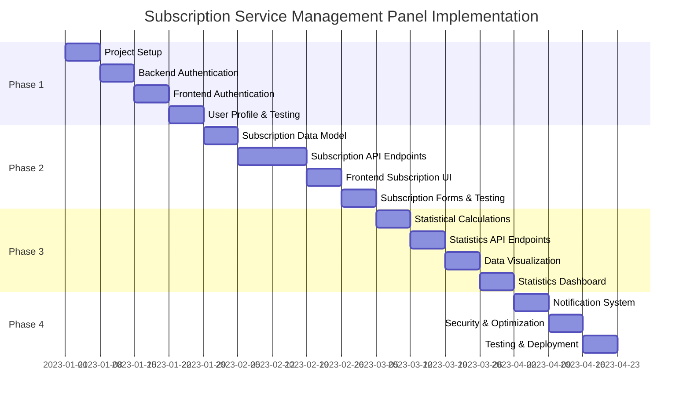

# Implementation Plan: Subscription Service Management Panel

## Overview
This document outlines the phased implementation plan for the Subscription Service Management Panel. The implementation is structured into five phases, with clear milestones, dependencies, and deliverables for each phase.

## Phase 1: Initial Setup and User Authentication

### Duration
4 weeks

### Objectives
- Set up the project infrastructure and development environment
- Implement the backend foundation with Rust and Axum
- Implement the frontend foundation with React and TypeScript
- Create the database schema and migrations
- Implement user authentication and profile management

### Tasks

#### Week 1: Project Setup
1. Set up the Rust backend project structure
   - Configure Cargo project
   - Set up directory structure
   - Configure logging and error handling
   - Set up development environment

2. Set up the React frontend project structure
   - Configure Vite and TypeScript
   - Set up directory structure
   - Configure Tailwind CSS
   - Set up development environment

3. Set up the database
   - Configure PostgreSQL
   - Create initial migration scripts
   - Set up connection pooling
   - Configure SQLx

4. Set up CI/CD pipeline
   - Configure GitHub Actions
   - Set up linting and formatting
   - Configure test runners
   - Set up build process

#### Week 2: Backend Authentication
1. Implement user model and repository
   - Create user schema
   - Implement CRUD operations
   - Add password hashing
   - Write tests

2. Implement JWT authentication
   - Create JWT utilities
   - Implement token generation and validation
   - Create authentication middleware
   - Write tests

3. Implement authentication endpoints
   - Create registration endpoint
   - Create login endpoint
   - Create token refresh endpoint
   - Create password reset endpoints
   - Write tests

#### Week 3: Frontend Authentication
1. Set up frontend routing
   - Configure React Router
   - Create route guards
   - Set up layout components

2. Implement authentication state management
   - Create authentication store with Zustand
   - Implement token storage and management
   - Create authentication hooks

3. Implement authentication UI
   - Create login page
   - Create registration page
   - Create forgot password page
   - Create reset password page
   - Add form validation

#### Week 4: User Profile and Testing
1. Implement user profile management
   - Create backend endpoints for profile management
   - Create frontend profile components
   - Implement profile settings page

2. Comprehensive testing
   - Write integration tests for authentication flow
   - Test edge cases and error handling
   - Perform security testing

3. Documentation
   - Document API endpoints
   - Create user guide for authentication features
   - Document code and architecture

### Deliverables
- Functional user registration and login system
- Password reset functionality
- User profile management
- Authentication middleware for protected routes
- Comprehensive test suite
- Documentation

### Dependencies
- None (initial phase)

### Risks and Mitigations
- **Risk**: Learning curve for Rust development
  - **Mitigation**: Allocate extra time for learning, use established libraries

- **Risk**: Security vulnerabilities in authentication
  - **Mitigation**: Follow security best practices, conduct security review

## Phase 2: Subscription Management System

### Duration
5 weeks

### Objectives
- Implement subscription data model and CRUD operations
- Create subscription management UI
- Implement subscription cycle calculations
- Add subscription status management

### Tasks

#### Week 1: Subscription Data Model
1. Design and implement subscription schema
   - Create database migrations
   - Implement subscription model
   - Add relationships to user model

2. Implement subscription repository
   - Create CRUD operations
   - Implement filtering and sorting
   - Add pagination support
   - Write tests

3. Implement subscription cycle logic
   - Create utilities for cycle calculations
   - Implement next payment date calculation
   - Add status management logic
   - Write tests

#### Week 2-3: Subscription API Endpoints
1. Implement subscription CRUD endpoints
   - Create endpoints for listing subscriptions
   - Add endpoints for creating subscriptions
   - Implement endpoints for updating subscriptions
   - Add endpoints for deleting subscriptions
   - Write tests

2. Implement subscription status endpoints
   - Create endpoints for pausing subscriptions
   - Add endpoints for resuming subscriptions
   - Implement endpoints for cancelling subscriptions
   - Write tests

3. Implement payment record endpoints
   - Create endpoints for listing payment records
   - Add endpoints for creating payment records
   - Write tests

#### Week 4: Frontend Subscription Management
1. Implement subscription state management
   - Create subscription store with Zustand
   - Implement data fetching and caching
   - Add CRUD operations
   - Create subscription hooks

2. Implement subscription list view
   - Create subscription list component
   - Add filtering and sorting
   - Implement pagination
   - Add quick actions

3. Implement subscription detail view
   - Create subscription detail component
   - Add payment history
   - Implement action buttons
   - Add status management

#### Week 5: Subscription Forms and Testing
1. Implement subscription forms
   - Create add subscription form
   - Implement edit subscription form
   - Add form validation
   - Create date and currency inputs

2. Comprehensive testing
   - Write integration tests for subscription management
   - Test cycle calculations and edge cases
   - Perform UI testing

3. Documentation
   - Document subscription API endpoints
   - Create user guide for subscription features
   - Document code and architecture

### Deliverables
- Complete subscription management system
- Subscription CRUD operations
- Payment record tracking
- Subscription cycle and status management
- Subscription management UI
- Comprehensive test suite
- Documentation

### Dependencies
- Phase 1 (Authentication System)

### Risks and Mitigations
- **Risk**: Complex subscription cycle calculations
  - **Mitigation**: Thorough testing with various scenarios, clear documentation

- **Risk**: Performance issues with large subscription datasets
  - **Mitigation**: Implement pagination, optimize queries, add caching

## Phase 3: Statistics and Reporting

### Duration
4 weeks

### Objectives
- Implement statistical calculations for subscription expenses
- Create data visualization components
- Add export functionality for reports
- Build statistics dashboard

### Tasks

#### Week 1: Statistical Calculations
1. Implement expense calculation logic
   - Create monthly expense calculations
   - Add yearly expense calculations
   - Implement average expense calculations
   - Write tests

2. Implement subscription breakdown logic
   - Create cycle-based breakdown calculations
   - Add category-based breakdown calculations
   - Implement trend analysis
   - Write tests

#### Week 2: Statistics API Endpoints
1. Implement statistics endpoints
   - Create endpoints for monthly expenses
   - Add endpoints for yearly expenses
   - Implement endpoints for subscription breakdown
   - Write tests

2. Implement export endpoints
   - Create CSV export functionality
   - Add PDF export functionality
   - Implement data formatting
   - Write tests

#### Week 3: Frontend Data Visualization
1. Implement statistics state management
   - Create statistics store with Zustand
   - Implement data fetching and caching
   - Add filtering and date range selection
   - Create statistics hooks

2. Implement visualization components
   - Create chart components using Recharts
   - Add monthly expense charts
   - Implement yearly expense charts
   - Create breakdown charts
   - Add responsive design for charts

#### Week 4: Statistics Dashboard and Testing
1. Implement statistics dashboard
   - Create statistics dashboard layout
   - Add expense summary cards
   - Implement trend indicators
   - Create export options

2. Comprehensive testing
   - Write integration tests for statistics calculations
   - Test export functionality
   - Perform UI testing for visualizations

3. Documentation
   - Document statistics API endpoints
   - Create user guide for statistics features
   - Document code and architecture

### Deliverables
- Complete statistics and reporting system
- Expense calculations and analysis
- Data visualization components
- Export functionality (CSV, PDF)
- Statistics dashboard
- Comprehensive test suite
- Documentation

### Dependencies
- Phase 2 (Subscription Management)

### Risks and Mitigations
- **Risk**: Performance issues with large datasets
  - **Mitigation**: Optimize queries, implement caching, use efficient data structures

- **Risk**: Complexity of data visualization
  - **Mitigation**: Use established libraries, create reusable components

## Phase 4: Finalization and Security Enhancements

### Duration
3 weeks

### Objectives
- Implement notification system
- Enhance security measures
- Optimize performance
- Improve user experience
- Prepare for deployment

### Tasks

#### Week 1: Notification System
1. Implement notification data model
   - Create database migrations
   - Implement notification model
   - Add relationships to user model

2. Implement notification API endpoints
   - Create endpoints for listing notifications
   - Add endpoints for marking notifications as read
   - Implement notification generation logic
   - Write tests

3. Implement frontend notification components
   - Create notification store with Zustand
   - Add notification bell component
   - Implement notification list
   - Create notification settings

#### Week 2: Security Enhancements and Optimization
1. Implement security enhancements
   - Add rate limiting
   - Implement CSRF protection
   - Add secure HTTP headers
   - Enhance input validation

2. Optimize performance
   - Optimize database queries
   - Add caching where appropriate
   - Implement frontend optimizations
   - Measure and improve load times

3. Improve error handling
   - Enhance error responses
   - Implement global error handling
   - Add error logging and monitoring
   - Create user-friendly error messages

#### Week 3: Final Testing and Deployment Preparation
1. Comprehensive testing
   - Conduct end-to-end testing
   - Perform security testing
   - Test performance under load
   - Verify accessibility compliance

2. Prepare for deployment
   - Create production configuration
   - Set up deployment scripts
   - Prepare documentation for operations
   - Create backup and recovery procedures

3. Final documentation
   - Update all documentation
   - Create deployment guide
   - Prepare user manual
   - Document known issues and limitations

### Deliverables
- Notification system
- Enhanced security measures
- Optimized performance
- Improved error handling
- Deployment-ready application
- Comprehensive test suite
- Complete documentation

### Dependencies
- Phase 3 (Statistics and Reporting)

### Risks and Mitigations
- **Risk**: Security vulnerabilities
  - **Mitigation**: Security audit, follow best practices, regular updates

- **Risk**: Performance issues in production
  - **Mitigation**: Load testing, performance monitoring, scalable architecture

## Phase 5: Future Improvements (Post-Launch)

### Potential Features
1. Third-party API integrations
   - Integration with popular subscription services
   - Automatic subscription tracking
   - Email scanning for subscription detection

2. Payment gateway integration
   - Direct payment processing
   - Automatic renewal handling
   - Payment reminders

3. Mobile application
   - Native mobile experience
   - Push notifications
   - Offline capabilities

4. Advanced analytics
   - Spending predictions
   - Optimization recommendations
   - Budget planning

5. Social features
   - Subscription recommendations
   - Cost comparisons
   - Sharing capabilities

### Timeline
To be determined based on user feedback and business priorities after initial launch.

## Overall Timeline

## Resource Allocation

### Backend Development
- 1 Senior Rust Developer (full-time)
- 1 Backend Developer (full-time)
- 1 Database Specialist (part-time)

### Frontend Development
- 1 Senior React Developer (full-time)
- 1 Frontend Developer (full-time)
- 1 UI/UX Designer (part-time)

### Quality Assurance
- 1 QA Engineer (full-time)
- 1 Security Specialist (part-time)

### Project Management
- 1 Project Manager (part-time)
- 1 Technical Writer (part-time)

## Success Criteria

### Technical Criteria
- All features implemented according to specifications
- Code passes all tests with >90% coverage
- Performance meets or exceeds benchmarks
- No critical security vulnerabilities
- Accessibility compliance (WCAG 2.1 AA)

### Business Criteria
- User registration and retention targets met
- Subscription management functionality works reliably
- Statistics and reporting provide accurate insights
- User feedback is positive (>4/5 rating)
- System can scale to handle projected user growth 