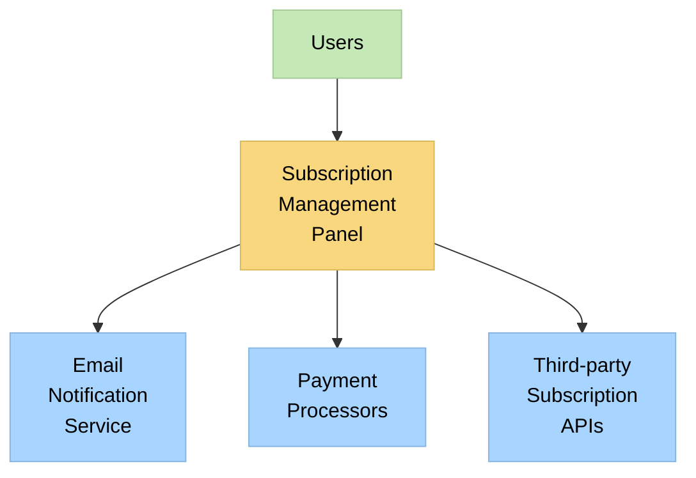
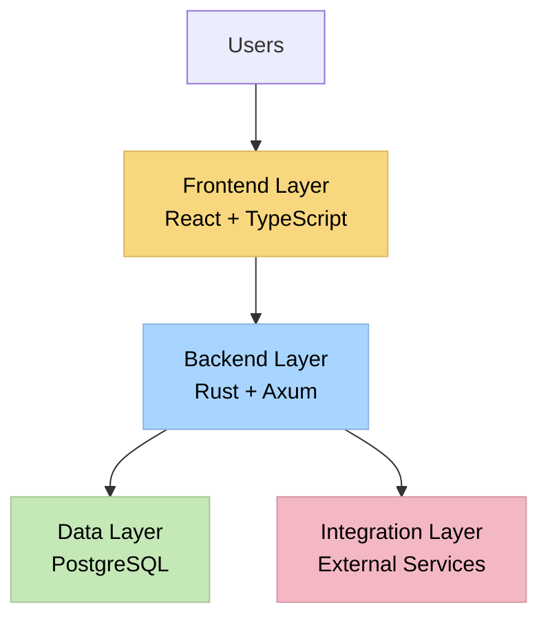
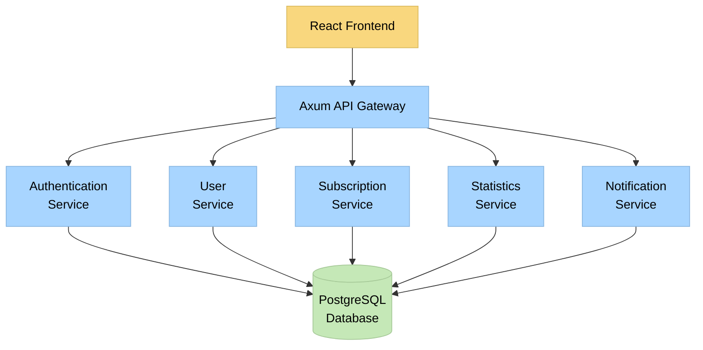
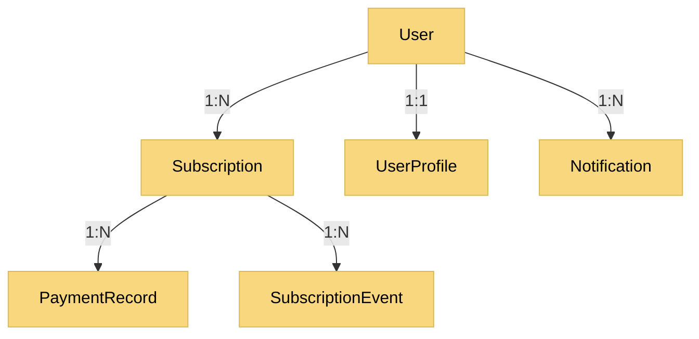
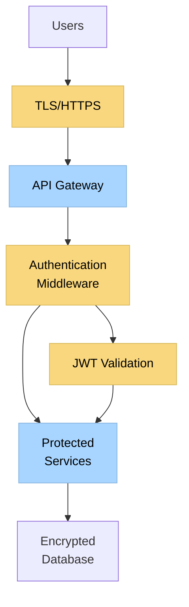
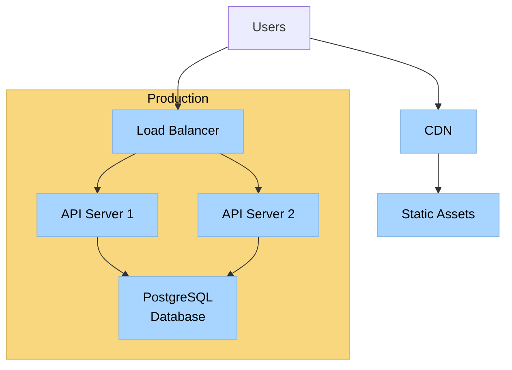

# System Architecture Document: Subscription Service Management Panel

## 1. Introduction
- **Purpose**: Define the architectural foundation for the Subscription Service Management Panel
- **Scope**: End-to-end system architecture including backend, frontend, database, and integrations
- **Audience**: Development team, stakeholders, and future maintainers
- **References**: 
  - PRD (specs/001-prd.md)
  - Memory Bank documentation

## 2. System Context
- **System Purpose**: Provide a centralized platform for users to manage, track, and analyze their subscription services
- **Context Diagram**:

- **External Systems**:
  - Email Notification Service: For sending renewal reminders and alerts
  - Payment Processors: Future integration for subscription renewals
  - Third-party Subscription APIs: Future integration for automatic tracking
- **User Types**: 
  - End Users: Individuals managing their subscriptions
  - Administrators: System administrators for maintenance and support

## 3. Architecture Overview
- **Architecture Style**: Layered architecture with RESTful API backend and component-based frontend
- **High-Level Architecture**:

- **Key Components**:
  - Frontend: React-based SPA with Tailwind CSS and Radix UI
  - Backend API: Rust-based RESTful API using Axum
  - Database: PostgreSQL with SQLx for type-safe queries
  - Authentication: JWT-based authentication
  - Analytics: Client-side data visualization with Recharts
- **Technology Stack**:
  - Backend: Rust, Axum, Tokio, SQLx, PostgreSQL
  - Frontend: React, TypeScript, Tailwind CSS, Radix UI, Zustand, Recharts
  - DevOps: Docker, potentially AWS/GCP for hosting

## 4. Component Architecture
- **Component Diagram**:

- **Component Descriptions**:
  - **React Frontend**: Single-page application with responsive design
    - Responsibilities: User interface, client-side validation, state management
    - Interfaces: REST API calls to backend
  
  - **Axum API Gateway**: Central entry point for API requests
    - Responsibilities: Request routing, authentication verification, response formatting
    - Interfaces: REST endpoints for frontend, internal service calls
  
  - **Authentication Service**: Handles user authentication and authorization
    - Responsibilities: User registration, login, JWT management, password reset
    - Interfaces: User database, email service integration
  
  - **User Service**: Manages user profiles and settings
    - Responsibilities: CRUD operations for user profiles, preference management
    - Interfaces: User database
  
  - **Subscription Service**: Core subscription management functionality
    - Responsibilities: CRUD operations for subscriptions, cycle calculations, status management
    - Interfaces: Subscription database, notification service
  
  - **Statistics Service**: Generates subscription analytics and reports
    - Responsibilities: Expense calculations, trend analysis, report generation
    - Interfaces: Subscription database, export functionality
  
  - **Notification Service**: Manages user notifications
    - Responsibilities: Renewal reminders, alert generation, notification preferences
    - Interfaces: Email service, subscription service
  
- **Component Interactions**:
  - Authentication flow: Frontend → API Gateway → Authentication Service → Database
  - Subscription management flow: Frontend → API Gateway → Subscription Service → Database
  - Statistics generation flow: Frontend → API Gateway → Statistics Service → Database
  - Notification flow: Subscription Service → Notification Service → Email Service → User

- **API Specifications**:
  - Authentication API: `/api/auth/*` - Registration, login, token refresh, password reset
  - User API: `/api/users/*` - Profile management, preferences
  - Subscription API: `/api/subscriptions/*` - CRUD operations, status changes
  - Statistics API: `/api/statistics/*` - Expense reports, analytics, data export

## 5. Data Architecture
- **Data Model**:

- **Entity Descriptions**:
  - **User**:
    - Attributes: id, email, password_hash, created_at, updated_at
    - Relationships: One-to-one with UserProfile, One-to-many with Subscription and Notification
  
  - **UserProfile**:
    - Attributes: id, user_id, name, preferences_json, created_at, updated_at
    - Relationships: One-to-one with User
  
  - **Subscription**:
    - Attributes: id, user_id, name, description, cost, currency, start_date, cycle, status, next_payment_date, created_at, updated_at
    - Relationships: Many-to-one with User, One-to-many with PaymentRecord and SubscriptionEvent
  
  - **PaymentRecord**:
    - Attributes: id, subscription_id, amount, currency, payment_date, notes, created_at
    - Relationships: Many-to-one with Subscription
  
  - **Notification**:
    - Attributes: id, user_id, type, message, read, created_at, updated_at
    - Relationships: Many-to-one with User
  
  - **SubscriptionEvent**:
    - Attributes: id, subscription_id, event_type, event_date, notes, created_at
    - Relationships: Many-to-one with Subscription

- **Data Storage**:
  - Primary storage: PostgreSQL database
  - Schema-based approach with migrations for version control
  - Indexes on frequently queried fields (user_id, subscription status, payment dates)
  - JSON storage for flexible attributes (preferences, metadata)

- **Data Access**:
  - Repository pattern for data access abstraction
  - SQLx for type-safe SQL queries
  - Connection pooling for efficient database connections
  - Transactions for operations requiring atomicity

- **Data Migration**:
  - SQL-based migration scripts
  - Version-controlled migrations with up/down capabilities
  - Data validation during migrations

## 6. Security Architecture
- **Security Model**:

- **Authentication**:
  - JWT-based authentication
  - Secure password hashing with bcrypt or Argon2
  - Token expiration and refresh mechanism
  - HTTPS for all communications

- **Authorization**:
  - Role-based access control (User, Admin)
  - Resource-based authorization for user data
  - Middleware for authorization checks

- **Data Protection**:
  - Encryption of sensitive data at rest
  - TLS for data in transit
  - Input validation and sanitization
  - Parameterized queries to prevent SQL injection

- **Security Controls**:
  - Rate limiting to prevent abuse
  - CSRF protection
  - Content Security Policy
  - Secure HTTP headers

- **Audit and Logging**:
  - Authentication events logging
  - Critical operation audit trails
  - Error logging with appropriate detail levels
  - Structured logging for analysis

## 7. Deployment Architecture
- **Deployment Model**:

- **Environment Descriptions**:
  - **Development**: Local development environment with Docker Compose
  - **Staging**: Cloud-based environment for testing
  - **Production**: Scalable cloud deployment with redundancy

- **Infrastructure Requirements**:
  - Compute: Virtual machines or containers for API servers
  - Database: Managed PostgreSQL instance with backups
  - Storage: Object storage for static assets
  - Networking: Load balancer, CDN for static content

- **Scaling Approach**:
  - Horizontal scaling for API servers
  - Database read replicas for scaling read operations
  - CDN for static content delivery
  - Caching strategies for frequently accessed data

## 8. Quality Attributes
- **Performance**:
  - Response time targets: < 200ms for API requests
  - Efficient database queries with proper indexing
  - Frontend optimization with code splitting and lazy loading
  - Caching for frequently accessed data

- **Scalability**:
  - Stateless API design for horizontal scaling
  - Database connection pooling
  - Asynchronous processing for long-running tasks
  - Pagination for large data sets

- **Availability**:
  - Target uptime: 99.9%
  - Redundant API servers
  - Database failover capability
  - Graceful degradation for non-critical features

- **Maintainability**:
  - Modular code structure
  - Comprehensive test coverage
  - Consistent coding standards
  - Documentation for all components
  - Type safety with Rust and TypeScript

- **Reliability**:
  - Error handling and recovery mechanisms
  - Retry logic for transient failures
  - Circuit breakers for external dependencies
  - Comprehensive logging for troubleshooting

- **Portability**:
  - Containerization for consistent environments
  - Configuration via environment variables
  - Platform-agnostic deployment options

## 9. Cross-Cutting Concerns
- **Logging**:
  - Structured logging with context information
  - Log levels (debug, info, warn, error)
  - Correlation IDs for request tracing
  - Log aggregation and analysis

- **Error Handling**:
  - Consistent error response format
  - Appropriate error status codes
  - Detailed error messages for developers
  - User-friendly error messages for end users

- **Monitoring**:
  - Health checks for all services
  - Metrics collection for performance and usage
  - Alerting for critical issues
  - Dashboard for system status

- **Configuration Management**:
  - Environment-specific configuration
  - Secret management for sensitive values
  - Feature flags for controlled rollout
  - Configuration validation on startup

- **Internationalization**:
  - Support for multiple languages
  - Localized date and currency formats
  - Right-to-left language support
  - Translation management system

## 10. Architecture Decisions
- **ADR-001**: Selection of Rust with Axum for backend
  - Benefits: Performance, safety, modern async support
  - Alternatives considered: Node.js, Go

- **ADR-002**: Selection of React with TypeScript for frontend
  - Benefits: Type safety, component reusability, ecosystem
  - Alternatives considered: Vue, Angular

- **ADR-003**: Selection of PostgreSQL for database
  - Benefits: ACID compliance, JSON support, mature ecosystem
  - Alternatives considered: MySQL, MongoDB

- **ADR-004**: JWT for authentication
  - Benefits: Stateless, scalable, standard-based
  - Alternatives considered: Session-based auth, OAuth

- **ADR-005**: Layered architecture approach
  - Benefits: Separation of concerns, maintainability, testability
  - Alternatives considered: Microservices, monolith

## 11. Risks and Mitigations
- **Risk**: Performance issues with large subscription datasets
  - **Mitigation**: Implement pagination, optimize queries, add caching

- **Risk**: Security vulnerabilities in authentication
  - **Mitigation**: Regular security audits, follow OWASP guidelines, use established libraries

- **Risk**: Scalability challenges with growing user base
  - **Mitigation**: Design for horizontal scaling, implement database sharding if needed

- **Risk**: Integration challenges with third-party services
  - **Mitigation**: Implement adapter pattern, circuit breakers, and comprehensive testing

- **Risk**: Data loss or corruption
  - **Mitigation**: Regular backups, data validation, audit trails

## 12. Glossary
- **Subscription**: A recurring service that a user pays for periodically
- **Cycle**: The frequency of subscription payments (daily, weekly, monthly, etc.)
- **JWT**: JSON Web Token, used for authentication
- **SQLx**: Rust SQL toolkit for type-safe database access
- **Axum**: Rust web framework for building APIs
- **Zustand**: State management library for React
- **Recharts**: Charting library for React applications 